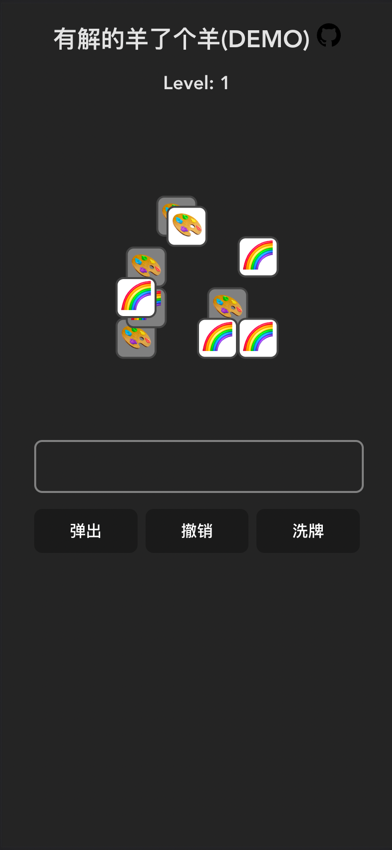

# 能够解出来的 "羊了个羊" 小游戏 Demo

坑爹的小游戏（本来玩法挺有意思的，非得恶心人），根本无解（99.99%无解），气的我自己写了个 demo，
扫码或：<a href="https://solvable-sheep-game.streakingman.com/" target="_blank">pc 浏览器体验</a>

## Feature

-   弹出：弹出队列左侧第一个，无限次数
-   撤销：撤销上一次操作，无限次数
-   洗牌：哗啦哗啦，无限次数
-   关卡：50 关玩到爽，可直接跳

开心就好 😄

## Contribution

vite+react 实现，欢迎 star、issue、pr、fork（尽量标注原仓库地址）

## Todo List

-   [x] 基础操作
-   [x] 关卡生成
-   [ ] UI/UX 优化
-   [ ] 多主题
-   [ ] 计时
-   [ ] 性能优化
-   [ ] 点击时的缓冲队列，优化交互动画效果
-   [ ] 该游戏似乎涉嫌抄袭，考证后补充来源说明

## License

[GNU GENERAL PUBLIC LICENSE Version 3](LICENSE.md)
