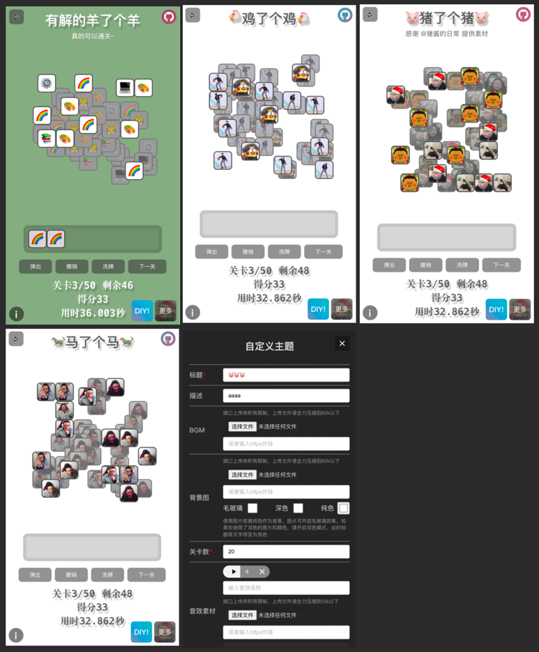
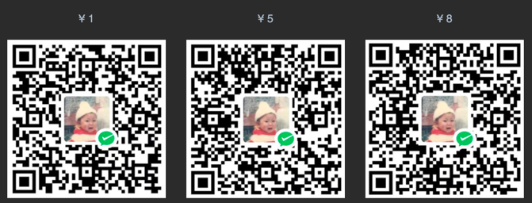

# 能够解出来的 "羊了个羊" 小游戏 Demo

    
    
    
    
    
    
    
    
    
    

坑爹的小游戏（本来玩法挺有意思的，非得恶心人），根本无解（99.99%无解），气的我自己写了个 demo，
扫二维码或<a href="https://solvable-sheep-game.streakingman.com/" target="_blank">pc 浏览器体验</a>

**声明：本项目仅供交流，禁止商用！否则后果自负。基于此项目的二创都是欢迎的，但非二创请不要删除原仓库地址
（啥都不改唯独删除来源我真的会谢 🙄️，请尊重他人劳动成果）**

## Feature

-   弹出：弹出队列左侧第一个，无限次数
-   撤销：撤销上一次操作，无限次数
-   洗牌：哗啦哗啦，无限次数
-   关卡：20 关玩到爽，可直接跳
-   内置主题：金轮、
    骚猪、
    ikun（露出黑脚）等
-   自定义主题：自定义图片和音效，快速整活
-   排行榜：皇城 pk

开心就好 😄

## Contribution

vite+react 实现，欢迎 star、issue、pr、fork（尽量标注原仓库地址）

## Related Repo

<a href="https://github.com/opendilab" target="_blank">opendilab</a> 的 AI 整活！移步
<a href="https://github.com/opendilab/DI-sheep" target="_blank">DI-sheep：深度强化学习 + 羊了个羊</a>

## Todo List

-   [x] 基础操作
-   [x] 关卡生成
-   [x] UI/UX 优化
-   [x] 多主题
-   [x] 计时、得分、保存进度机制
-   [x] 排行榜
-   [ ] 性能优化
-   [x] BGM/音效
-   [ ] ~~点击时的缓冲队列，优化交互动画效果~~
-   [x] 该游戏似乎涉嫌抄袭，考证后补充来源说明
-   [ ] ~~桌面应用~~
-   [x] 路径区分主题
-   [x] 主题自定义
-   [x] 本地图片、音频配置

## 二次开发

项目的自定义主题功能涉及到后台存储（Bmob 懒人数据库），如果您只是简单的整活，可能并不需要相关的逻辑。
详细的二次开发说明请移步这里[DIY 指南](/diy/README.md)

## License

[GNU GENERAL PUBLIC LICENSE Version 3](LICENSE.md)

## 资助

~~由于各种白嫖的静态资源托管、后台服务的免费额度都已用完，目前自费升级了相关套餐。~~
如果您喜欢这个项目，觉得本项目对你有帮助的话，可以扫描下方付款码请我喝杯咖啡 ☕️/~~分摊后台服务费用~~～ 😘

2023.5.5 更新：Bmob 服务到期，后台服务已下线，相关功能暂时无法使用，如有需要请自行搭建后台服务

