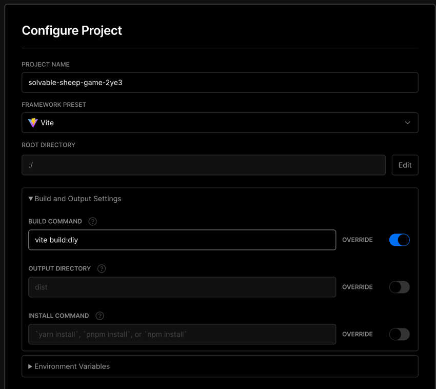
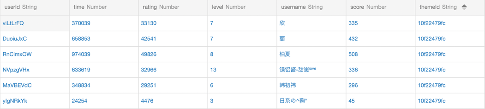

# DIY 指南

游戏的核心逻辑已经封装到了 `src/components/Game.tsx` ，方便大家魔改， 主题配置的类型声明见 `src/themes/interface.ts`

你可以先通过超酷的[stackblitz](https://stackblitz.com/edit/solvable-sheep-game?file=diy%2Fdiy.theme.json&terminal=dev:diy)
在线体验一番（等待依赖安装完成后，编辑配置将实时更新）再回来看这里的指南。

## 准备工作

### 环境准备

安装以下内容

-   [git](https://git-scm.com/)
-   [node](https://nodejs.org/en/)

### 克隆仓库

直接克隆本仓库或者 fork 后，安装项目依赖

```shell
git clone https://github.com/StreakingMan/solvable-sheep-game.git
cd solvable-sheep-game
npm install -g yarn
yarn install
```

## 素材配置

原项目的自定义主题功能使用了 Bmob 后台，DIY 时并不需要相关的逻辑，您只需要改动 `diy` 文件下的文件：
图片以及音频素材复制到 `diy/public` 下， 并配置 `diy/diy.theme.json`
文件即可，配置格式见 `src/themes/interface.ts` ，

以下是`diy.theme.json`配置字段的说明：

-   title 标题
-   desc 描述
-   bgm 背景音乐文件相对于 `diy/public` 的路径
-   dark 深色模式（标题为亮色）
-   background 背景图片文件相对于 `diy/public` 的路径
-   backgroundBlur 背景图片是否添加毛玻璃效果
-   backgroundColor 背景颜色 CSS 色值
-   pure 纯净模式，DIY 时已开启
-   maxLevel 最大关卡数，默认 50
-   sounds 音效数组
    -   name 名称
    -   src 音效文件相对于 `diy/public` 的路径
-   icons 图标数组
    -   name 名称，三连判断的依据
    -   content 图片文件相对于 `diy/public` 的路径
    -   clickSound 点击音效的 `name`
    -   triple 三连音效的 `name`
-   operateSoundMap 操作音效
    -   shift 弹出音效的 `name`
    -   undo 撤销音效的 `name`
    -   wash 洗牌音效的 `name`

配置完成后调试运行，点击链接即可

```shell
yarn dev:diy

#   ➜  Local:   http://localhost:5556/
```

## 构建发布

运行命令

```shell
yarn build:diy
```

会在 `diy/diy-dist` 下生成静态资源，直接将这些文件复制服务器上做代理即可。如果嫌麻烦，推荐使用 [vercel](https://vercel.com/)
一键部署（每月免费 100G 流量）， 将更改后的项目推到自己的 github（gitlab，bitbucket 同样支持）仓库，
使用 github 账号登录 vercel 后导入该项目，构建模版选择 vite，
构建命令更改为 `yarn build:diy` 输出地址改为 `diy/diy-dist` 即可 。见下图：



导入后项目有更新会自动构建，并且会生成 vercel 的二级链接（也可以自定义域名）。

## 其他

如果您想体验项目的完整功能，则需要注册一个 [Bmob](https://www.bmobapp.com/) 账号，
注册后新建应用（有一年的白嫖版，免费请求数虽然很客观，但并发数有限制，请根据自己的实际流量
选择升级套餐，或者其他存储方案）

新建应用后，去到设置页面拷贝密钥和安全码到项目的 `.env` 文件中

-   VITE_BMOB_SECRETKEY=设置->应用密钥->SecretKey
-   VITE_BMOB_SECCODE=设置->安全验证->Api 安全码

ps: 如果您的项目托管在公共仓库中，请注意保护密钥，本地使用 `.env.local` 进行配置

应用创建后，点击【云数据库】，创建两个表 `config` 和 `file`

`config` 表用来存储自定义配置的 json 字符串，需要新增 `content` 列

`rank` 表，储存排名信息


最后，开发和打包命令分别使用 `yarn dev` 和 `yarn build` 即可
